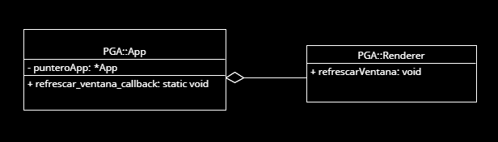

# PRÁCTICAS PGA


[Enlace a GitHub](https://github.com/aje00009/PGA_PRACTICE)

### PRÁCTICA 1

* Ejercicio 2: para poder solucionar el problema que se plantea, deberíamos usar una clase que encapsule y actúe de arbitro 
entre el resto de clases de nuestra aplicación gráfica. La llamaremos ``App``. Esta clase deberá contener una instancia de `Renderer`. Dentro de `App` podemos definir métodos
estáticos, de forma que se asemejen a una función normal en C++. Para acceder al ``Renderer`` desde cualquier parte del código, debemos mantener
una instancia ``static App* punteroApp`` que sirva de puntero a la instancia ÚNICA de la aplicación. Nos quedaría lo siguiente:

```
 namespace PAG {
    class App {
        Renderer renderer;
        static App* punteroApp;
        
        ...
        
        static void refrescar_ventana_callback()
            punteroApp->renderer.refrescarVentana();
        
        ...
    }
 }
```

Si queremos visualizarlo de forma visual, tenemos el siguiente UML:



Sin meternos en detalles de atributos que pudieran llegar a tener cada clase, observamos que se trata
de, simplemente, una relación de composición, en la que ``App`` usa a `Renderer` para refrescar la ventana. Es 
una relación de composición ya que si la aplicación no existe, el renderer tampoco debería de existir por sí solo.