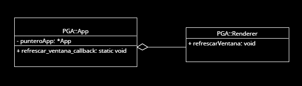
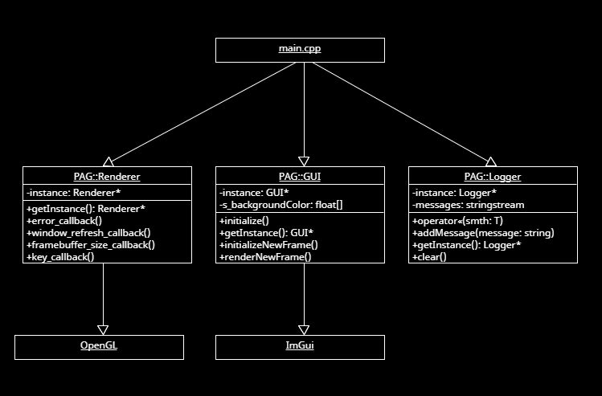

# PRÁCTICAS PAG

_Autor: Alberto Jiménez Expósito_

_Email: aje00009@red.ujaen.es_

[Enlace a GitHub](https://github.com/aje00009/PGA_PRACTICE)

### PRÁCTICA 1

* Ejercicio 2: para poder solucionar el problema que se plantea, deberíamos usar una clase que encapsule y actúe de arbitro 
entre el resto de clases de nuestra aplicación gráfica. La llamaremos ``App``. Esta clase deberá contener una instancia de `Renderer`. Dentro de `App` podemos definir métodos
estáticos, de forma que se asemejen a una función normal en C++. Para acceder al ``Renderer`` desde cualquier parte del código, debemos mantener
una instancia ``static App* punteroApp`` que sirva de puntero a la instancia ÚNICA de la aplicación. Nos quedaría lo siguiente:

```
 namespace PAG {
    class App {
        Renderer renderer;
        static App* punteroApp;
        
        ...
        
        static void refrescar_ventana_callback()
            punteroApp->renderer.refrescarVentana();
        
        ...
    }
 }
```

Si queremos visualizarlo de forma visual, tenemos el siguiente UML:



Sin meternos en detalles de atributos que pudieran llegar a tener cada clase, observamos que se trata
de, simplemente, una relación de composición, en la que ``App`` usa a `Renderer` para refrescar la ventana. Es 
una relación de composición ya que si la aplicación no existe, el renderer tampoco debería de existir por sí solo.

### PRÁCTICA 2

En esta práctica encapsularemos tanto las ordenes relacionadas con OpenGL como las de la librería ImGui. 
Para ello, crearemos las clases ``Renderer`` y `GUI` dentro de un nombre de espacios (`PAG`) para mejorar nuestro código y 
el programa en sí.

Tras ello, el diagrama UML resultante es el siguiente:



De esta forma hemos encapsulado la funcionalidad de renderizar la escena y sus callbacks adheridos (y futuros modelos, nubes de puntos...) a
la clase ``PAG::Renderer``; la funcionalidad de diseñar y mostrar la interfaz de usuario (ventanas modales, popups, menús, etc.) a la clase
``PAG::GUI``; y la funcionalidad de almacenar los mensajes de log (errores, mensajes de aviso, eventos, etc.) a la clase `PAG::Logger`.