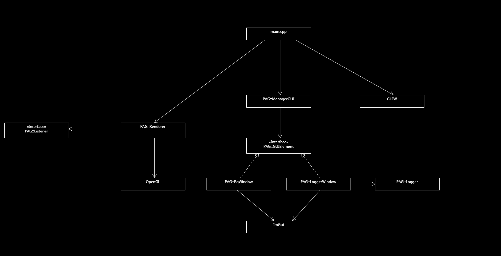
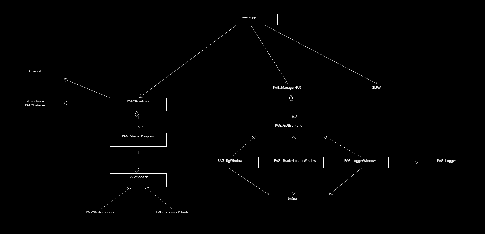
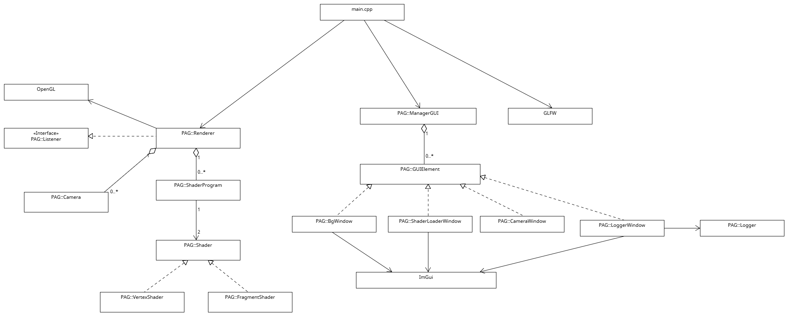

# PRÁCTICAS PAG

_Autor: Alberto Jiménez Expósito_

_Email: aje00009@red.ujaen.es_

[Enlace a GitHub](https://github.com/aje00009/PGA_PRACTICE)

### PRÁCTICA 1

* Ejercicio 2: para poder solucionar el problema que se plantea, deberíamos usar una clase que encapsule y actúe de arbitro 
entre el resto de clases de nuestra aplicación gráfica. La llamaremos ``App``. Esta clase deberá contener una instancia de `Renderer`. Dentro de `App` podemos definir métodos
estáticos, de forma que se asemejen a una función normal en C++. Para acceder al ``Renderer`` desde cualquier parte del código, debemos mantener
una instancia ``static App* punteroApp`` que sirva de puntero a la instancia ÚNICA de la aplicación. Nos quedaría lo siguiente:

```
 namespace PAG {
    class App {
        Renderer renderer;
        static App* punteroApp;
        
        ...
        
        static void refrescar_ventana_callback()
            punteroApp->renderer.refrescarVentana();
        
        ...
    }
 }
```

Si queremos visualizarlo de forma visual, tenemos el siguiente UML:


Sin meternos en detalles de atributos que pudieran llegar a tener cada clase, observamos que se trata
de, simplemente, una relación de composición, en la que ``App`` usa a `Renderer` para refrescar la ventana. Es 
una relación de composición ya que si la aplicación no existe, el renderer tampoco debería de existir por sí solo.

### PRÁCTICA 2

En esta práctica encapsularemos tanto las ordenes relacionadas con OpenGL como las de la librería ImGui. 
Para ello, crearemos las clases ``Renderer`` y `GUI` dentro de un nombre de espacios (`PAG`) para mejorar nuestro código y 
el programa en sí.

Tras ello, el diagrama UML resultante es el siguiente:


De esta forma hemos encapsulado la funcionalidad de renderizar la escena y sus callbacks adheridos (y futuros modelos, nubes de puntos...) a
la clase ``PAG::Renderer``; la funcionalidad de diseñar y mostrar la interfaz de usuario (ventanas modales, popups, menús, etc.) a la clase
``PAG::GUI``; y la funcionalidad de almacenar los mensajes de log (errores, mensajes de aviso, eventos, etc.) a la clase `PAG::Logger`.

### PRÁCTICA 3
En esta práctica nos hemos dedicado a crear los shader para poder procesar distintos datos (vértices, colores, etc.) para poder
dibujar diferentes objetos y formas a un nivel bajo.

Aquí estaría el UML resultante. He añadido el patrón observador para el ``Renderer``, de forma que este escuche de los eventos para
cambiar diferentes aspectos de la ventana de visualización durante la ejecución de la aplicación (color de fondo). Además,
he implementado una relación de herencia para diferenciar los distintos objetos (ventanas, controles...) en la cual tenemos una interfaz
``GUIElement`` que implementarán distintas ventanas y/o controles (`BgWindow`, `LoggerWindow`). Finalmente, tendré un gestor de la interfaz (`ManagerGUI`),
que se encargará de gestionar la inicialización y destrucción de objetos de ImGui y de manejar las ventanas que existen en la aplicación.



### PRÁCTICA 4

En esta práctica, nos hemos dedicado a la encapsulación de código de la parte de creación, compilación y enlazado del shader en otras
clases para mejorar la cohesión de mi proyecto. En este caso, he realizado una división del trabajo en distintas partes:

* ``ShaderProgram``: se encarga de enlazar los shaders
* ``Shader``: clase padre que heredarán cada uno de los tipos de shader y que se encarga de buscar los archivos, compilar los shaders, comprobar errores y eliminarlos
* ``ShaderLoaderWindow``: clase que representa la ventana para cargar el shader que se quiere renderizar. Se comunica con `Renderer` a través del patrón observador, avisandole cuando el usuario quiera cargar un nuevo shader
* ``Vertex/FragmentShader``: clase que hereda de Shader para procesar un vertex/fragment shader (llamar al constructor de `Shader`) indicando el tipo de shader
* ``Renderer``: ahora esta clase se encargará de guardar, por un lado, todos los shader programs creados en la ejecución de la aplicación en un vector. Así, podremos llevar una cuenta de los shader que el usuario ha creado, cada uno con su respectivo Vertex/Fragment Shader. Por otro lado, en todo momento tendremos el Shader Program activo (si es que hay alguno). También, se mantienen los atributos de idVAO, idVBO, etc. Estos son necesarios para crear el modelo, es decir, para decirle al shader como van a leerse los vertices y de que forman están conectados, etc. Esta función se queda en el shader pues este es el encargado de crear (render) el modelo.

En la imagen de abajo apreciamos el diagrama UML con los cambios comentados. 


### PRÁCTICA 5
En esta práctica incluimos la implementación de la camara virtual, de forma que se definan todos sus parámetros correspondientes
y los movimientos posibles de la misma. Para ello, podemos seleccionar desde la ventana de controles de ImGui el movimiento a utilizar. 
Después, podremos utilizar los botones que existe en la propia ventana o bien el botón izquierdo del ratón. En caso del zoom, no tendremos que
seleccionar ningún control, pues este estará siempre disponible si hacemos scroll con el ratón sobre la escena (no funcionará si lo hacemos sobre 
una de las ventanas de ImGui). También he incluido un botón de "reset" de la camara para reestablecer la camara como salía al principio (posición en {0,0,5}, lookAt en {0,0,0} y up {0,1,0})

En la parte de la implementación, se han añadido/modificado las siguientes cosas:
* **Camera**: clase que encapsula todos los datos referentes a la camara virtual (sist. coordenadas, fov, aspecto...) y los movimientos de la misma
* **CameraWindow**: clase que representa la ventana de la interfaz gráfica para los controles de la camara.
* **Renderer**: ahora esta clase tendrá un conjunto de camaras (de momento solo una, pero tendrá varias en el futuro), además de escuchar los eventos de la ventana de controles para implementar el patrón observador también con este aspecto de la aplicación
* **main.cpp**: ahora capturará los eventos de pulsado de ratón y de scroll para mandarlos a renderer para que tenga la información sobre la posición del ratón y que pueda realizar los movimientos correctamente

Los movimientos son los siguientes:
* **Pan**: mueve la posición a la que apunta la cámara de forma horizontal
* **Tilt**: mueve la posición a la que apunta la cámara de forma vertical
* **Dolly**: mueve la posición de la cámara en el eje X y/o Z
* **Orbit**: rota la cámara alrededor del punto al que mira
* **Zoom**: modifica el fov de la cámara para aumentar o disminuir el ángulo de visión de la cámara

Aquí estaría el UML resultante tras los cambios implementados en esta práctica
